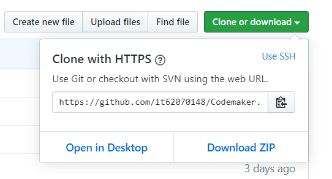

# Introduction
#### สวัสดีครับวันนี้พวกผมกลุ่มของผมได้ทำ โปรแกรม ขึ้นมาซึ้งเป็นโปรแกรมเข้ารหัสเข้ารหัสและถอดรหัสครับชื่อว่า Codemaker ซึ่ง โปรแกรมนี้ เหมาะกับการเข้ารหัสข้อมูลสำคัญต่างๆ เช่นพวก รหัสเข้าแอพพลิเคชั่นต่าง หรือจะต้องการเข้ารหัสข้อความและต้องการส่งให้ผู้รับโดยอยากต้องการให้คุณผู้ใช้กับผู้รับรู้กันอย่างเดียว ซึ่งโปรแกรมนี้เขียนด้วยภาษา C ทั้งหมด

<<<<<<< HEAD
# Installation
#### ขั้นตอนนะครับของให้คุณผู้ใช้นั้นกดปุ่ม 
=======
#Installation
#### ขั้นตอนนะครับของให้คุณผู้ใช้นั้น 
>>>>>>> d3dbf45b341b950a05799c17867680575d1f4b9f
