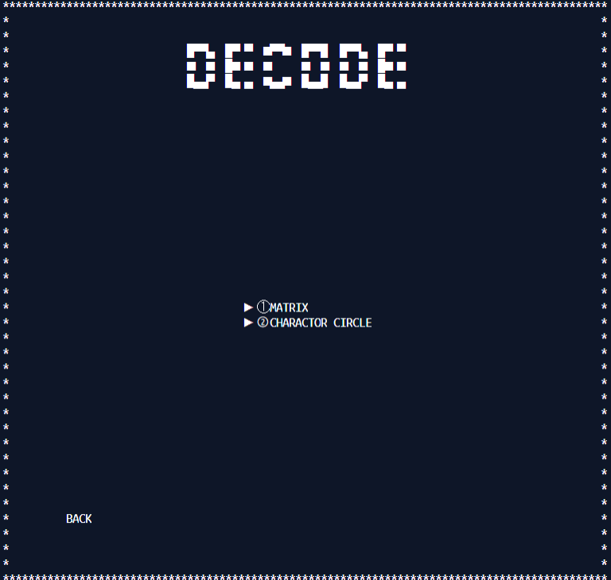

# Introduction

#### สวัสดีครับวันนี้พวกผมกลุ่มของผมได้ทำ โปรแกรม ขึ้นมาซึ้งเป็นโปรแกรมเข้ารหัสเข้ารหัสและถอดรหัสครับชื่อว่า Codemaker ซึ่ง โปรแกรมนี้ เหมาะกับการเข้ารหัสข้อมูลสำคัญต่างๆ เช่นพวก รหัสเข้าแอพพลิเคชั่นต่าง หรือจะต้องการเข้ารหัสข้อความและต้องการส่งให้ผู้รับโดยอยากต้องการให้คุณผู้ใช้กับผู้รับรู้กันอย่างเดียว ซึ่งโปรแกรมนี้เขียนด้วยภาษา C ทั้งหมด

# Installation
#### ขั้นตอนนะครับ ขอให้คุณผู้ใช้นั้นกดปุ่ม clone or download ดังภาพครับและเลือกรูปแบบการโหลดได้เลยครับ แนะนำเป็นการ Download Zip ครับ 
 

#### จากนั้นการเปิด command promt พิมพ์ cd ไปยัง folder ที่ท่านผู้ใช้ clone download มา และพิมพ์ make && make run ครับ เพื่อนทำการ complie file จากนั้น ทางcommand prompt จะ run โปรแกรมขึ้นมานะครับ และหลังจากที่คุณผู้ใช้ทำงานและปิด command prompt ไปแล้ว จะมี file codemaker.exe อยู่ครับซึ่งมากจากการที่เรา compile file ครั้งแรกครับ ซึ่งหากคุณผู้ใช้จะเข้าใช้ครั้งต่อไปให้เข้าไปที่ไฟล์ codemaker.exe ได้เลยครับ

# How to use

#### หน้าแรกจะเป็นหน้าเมนูในเลือกนะครับมี log in  sign up และก็ exit วิธีเลือกจะเป็นการ input ตัวเลขครับตาม ที่ขึ้นอยู่ข้างหน้าตัวเลือกครับ 

* menu
    * 1 login 
    * 2 sign up 
    * 3 exit
#### **หากท่านไม่ไม่บัญชีสามารถใช้สามารถใช้รหัสผ่านสำหรับการทดลองก่อนได้ครับคือ 
#### Username: admin
#### Password: 1234
#### หรือท่านจะสมัครใหม่ก็ได้เช่นกันครับ แต่ระวังตัวอักษรพิเศษตอนสมัครด้วยครับเพราะจะไม่สามารถใช้สมัคร username ได้ครับ
####  

#### หากท่านผู้ใช้ login แล้วจะมีหน้าแล้วจะมีให้เลือกนะครับว่าคุณผู้ใช้จะทำการเข้ารหัสหรือถอดรหัสรูปแบบใดครับซึ่งโปรแกรมของพวกเรามี 2 รูปแบบให้เลือกนะครับ คือ matrix กับ charactor circle ครับ

### Matrix
#### ถ้าเลือกแบบ Matrix จะขึ้นตามรูปนี้ครับมีให้เลือกระหว่าง 
* Encrypt (เข้ารหัส)
* Decode (ถอดรหัส)
#### 

### Encrypt
#### ถ้าคุณผู้ใช้เลือกในส่วนของการเข้ารหัสนะครับ 
* Input แรกจะเป็นข้อความของข้อความที่เราจะเข้ารหัสนะครับดังตัวอย่างครับ
    * I love IT KMITL.
* Input ต่อมาเป็นส่วนของเมทริกที่ต้องการ เข้ารหัสกับข้อความครับ ดังตัวอย่างครับ
    * 1 5 6 7 4 1 9 3 2
* Output ทางเราขอแนะนำให้ท่านบันทึกข้อความที่ output ออกมาครับ
    * 1269 817 686 1846 1330 986 1299 704 433 1250 691 421 1345 929 674 46 230 276

