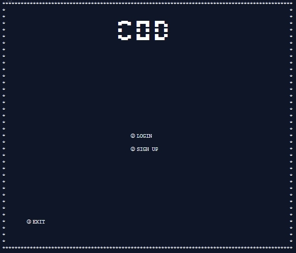

# Introduction

####    สวัสดีครับวันนี้พวกผมกลุ่มของผมได้ทำ โปรแกรม ขึ้นมาซึ้งเป็นโปรแกรมเข้ารหัสเข้ารหัสและถอดรหัสครับชื่อว่า Codemaker ซึ่ง โปรแกรมนี้ เหมาะกับการเข้ารหัสข้อมูลสำคัญต่างๆ เช่นพวก รหัสเข้าแอพพลิเคชั่นต่าง หรือจะต้องการเข้ารหัสข้อความและต้องการส่งให้ผู้รับโดยอยากต้องการให้คุณผู้ใช้กับผู้รับรู้กันอย่างเดียว ซึ่งโปรแกรมนี้เขียนด้วยภาษา C ทั้งหมด 

## คลิป video วิธีการใช้ ตาม link ใต้ล่างนี้ครับ
[How to use](https://youtu.be/-korO6F6Ro4)

# Installation
#### ขั้นตอนนะครับ ขอให้คุณผู้ใช้นั้นกดปุ่ม clone or download ดังภาพครับและเลือกรูปแบบการโหลดได้เลยครับ แนะนำเป็นการ Download Zip ครับ 
 

####    จากนั้นการเปิด command promt พิมพ์ cd ไปยัง folder ที่ท่านผู้ใช้ clone download มา และพิมพ์ make && make run ครับ เพื่อนทำการ complie file จากนั้น ทางcommand prompt จะ run โปรแกรมขึ้นมานะครับ และหลังจากที่คุณผู้ใช้ทำงานและปิด command prompt ไปแล้ว จะมี file codemaker.exe อยู่ครับซึ่งมากจากการที่เรา compile file ครั้งแรกครับ ซึ่งหากคุณผู้ใช้จะเข้าใช้ครั้งต่อไปให้เข้าไปที่ไฟล์ codemaker.exe ได้เลยครับ

# How to use

#### หน้าแรกจะเป็นหน้าเมนูในเลือกนะครับมี log in  sign up และก็ exit วิธีเลือกจะเป็นการ input ตัวเลขครับตาม ที่ขึ้นอยู่ข้างหน้าตัวเลือกครับ 

* menu
    * 1 login 
    * 2 sign up 
    * 3 exit
#### **หากท่านไม่ไม่บัญชีสามารถใช้สามารถใช้รหัสผ่านสำหรับการทดลองก่อนได้ครับคือ 
#### Username: admin
#### Password: 1234
#### หรือท่านจะสมัครใหม่ก็ได้เช่นกันครับ แต่ระวังตัวอักษรพิเศษตอนสมัครด้วยครับเพราะจะไม่สามารถใช้สมัคร username ได้ครับ
####  

#### หากท่านผู้ใช้ login แล้วจะมีหน้าแล้วจะมีให้เลือกนะครับว่าคุณผู้ใช้จะทำการเข้ารหัสหรือถอดรหัสรูปแบบใดครับซึ่งโปรแกรมของพวกเรามี 2 รูปแบบให้เลือกนะครับ คือ matrix กับ character circle ครับ

## Matrix
#### 
#### ถ้าเลือกแบบ Matrix จะขึ้นตามรูปนี้ครับมีให้เลือกระหว่าง 
* Encrypt (เข้ารหัส)
* Decode (ถอดรหัส)
#### 

### Encrypt

#### ส่วนของการเข้ารหัสนะครับ 
* Input แรกจะเป็นข้อความของข้อความที่เราจะเข้ารหัสนะครับ
    * I love IT KMITL.
* Input ต่อมาเป็นส่วนของเมทริกที่ต้องการ เข้ารหัสกับข้อความครับ 
    * 1 5 6 7 4 1 9 3 2
* Output ทางเราขอแนะนำให้ท่านบันทึกข้อความที่ output ออกมาครับ
    * 1269 817 686 1846 1330 986 1299 704 433 1250 691 421 1345 929 674 46 230 276

### Decode
#### ส่วนของการถอดรหัสถอดรหัส หากคุณผู้ใช้ลืมไม่ได้บันทึก Matrix ของข้อความที่เข้ารหัสไว้สามารถไปดุข้อมมูลได้ที่ history.txt
* Input แรกเป็นmatrixของข้อความที่คุณผู้ใช้ได้เข้ารหัสเอาไว้นะครับ
    * 1269 817 686 1846 1330 986 1299 704 433 1250 691 421 1345 929 674 46 230 276
* Input ที่สองเป็น matrix ที่เข้ารหัสกับข้อความครับ
    * 1 5 6 7 4 1 9 3 2
* output จะเป็นข้อความที่ถูกถอดรหัสครับ
    * I love IT KMITL.
#### 

### Character circle
#### ในส่วนของcharactor circle ครับจะเป็นการเข้ารหัสและถอดรหัสแบบวงตัวอักษรครับ
#### และส่วนของการเข้ารหัสแบบ Character circle จะมีการทำงานอยู่ 2 รูปแบบ คือเข้ารหัสกับถอดรหัส

### Encrypt
#### ต้อง Input E หรือ e เพื่อทำการเข้ารหัสครับ
* หลังจากนั้น input การเลื่นแล้วนะครับ ให้ ใส่ จำนวนเลขที่เราต้องการเลื่อนตำแหน่งของตัวอักษร 
    * 5
* Input ที่ 2 เป็นการใส่ข้อความ
    * hello
* output
    * mjqqt

### Decode
#### ต้อง Input D หรือ d เพื่อทำการเข้ารหัสครับ
* หลังจากนั้น input เลขที่เลื่อนตอนเราเข้ารหัสครับ
    * 5
* Input ที่ 2 เป็นข้อความที่เข้ารหัส
    * mjqqt
* output
    * hello
#### 

# Member

ชื่อ  | รหัสนักศึกษา  |  Github | facebook | E-mail
----- | ----- | ----- | ----- | ----- |
นายชญานนท์ สิริลัภนานนท์ | 62070038 | [Github](https://github.com/Sixfeetit?fbclid=IwAR1EeYrZjE8cyeQNrwmhUo9cG-wmEBGGwQ_y6OHsjtgmil84-yieQcoL0DI) | [facebook](https://www.facebook.com/chayanonsirilupnanon) | 62070038@kmitl.ac.th
นายณัฐวุฒิ สุขไชยพร | 62070068 | [Github](https://github.com/it62070068?fbclid=IwAR0cDpjqSk4weSprqBOHQouMYYPrtmaX7AbXKtUx3DO0tfWEtYRAHD3G_7g) | [facebook](https://www.facebook.com/oom.nutthavut) |62070068@kmitl.ac.th
นายทวีศักดิ์ จันทร์อำพล | 62070073 | [Github](https://github.com/it62070073?fbclid=IwAR3x8pxCHuIFJ1NN_QTvqYMR7OeSxr9RYCYoIcsyVlG5bGnTUYfZzLtXp70)  | [facebook](https://www.facebook.com/wentwpn) | 62070073@kmitl.ac.th
นายภาณุพงศ์ ทองใบน้อย | 62070148 | [Github](https://github.com/it62070148) | [facebook](https://www.facebook.com/profile.php?id=100008257810779) | 62070148@kmitl.ac.th

# Supporter
#### ขอขอบคุณอาจารย์ทั้ง 2 ท่านที่ได้ในแนวทางการสร้างโครงงาน และได้ในคำแนะนำในเรื่องการเขียน source code ภาษา C นี้ขึ้น

ผศ. ดร. กิติ์สุชาต พสุภา  | ผศ. ดร. ปานวิทย์ ธุวะนุติ  
----- | ----- |
 |  |

